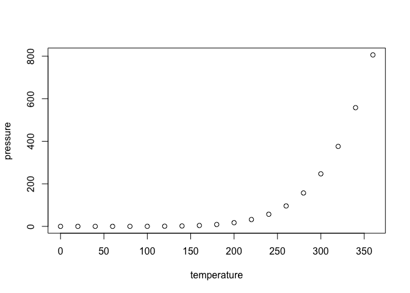

P8105 HW1
================
Ruoqi Wang
2026-09-27

``` r
data("penguins", package = "palmerpenguins")
```

## Problem 1

The `penguins` dataset contains information on penguins observed in the
Palmer Archipelago. The dataset includes three species: Adelie,
Chinstrap, and Gentoo. Important variables include `species`, `island`,
`bill_length_mm`, `bill_depth_mm`, `flipper_length_mm`, `body_mass_g`,
`sex`, and `year`. The dataset contains 344 observations and 8
variables. The mean flipper length is 200.9152047 mm.

``` r
penguin_plot <- ggplot(
  penguins,
  aes(
    x = bill_length_mm,
    y = flipper_length_mm,
    color = species
  )
) +
  geom_point()

penguin_plot
```

    ## Warning: Removed 2 rows containing missing values or values outside the scale range
    ## (`geom_point()`).

<!-- -->

``` r
ggsave(
  "p1_scatterplot.png",
  plot = penguin_plot,
  width = 6,
  height = 4
)
```

    ## Warning: Removed 2 rows containing missing values or values outside the scale range
    ## (`geom_point()`).

## Problem 2

``` r
set.seed(123)

normal_sample <- rnorm(10)

positive_sample <- normal_sample > 0

character_sample <- c(
  "one", "two", "three", "four", "five",
  "six", "seven", "eight", "nine", "ten"
)

factor_sample <- factor(
  c(
    "level1", "level2", "level3", "level1", "level2",
    "level3", "level1", "level2", "level3", "level1"
  )
)

problem_2_df <- tibble(
  normal_sample,
  positive_sample,
  character_sample,
  factor_sample
)
```

``` r
mean(pull(problem_2_df, normal_sample))
```

    ## [1] 0.07462564

``` r
mean(pull(problem_2_df, positive_sample))
```

    ## [1] 0.5

``` r
mean(pull(problem_2_df, character_sample))
```

    ## Warning in mean.default(pull(problem_2_df, character_sample)): argument is not
    ## numeric or logical: returning NA

    ## [1] NA

``` r
mean(pull(problem_2_df, factor_sample))
```

    ## Warning in mean.default(pull(problem_2_df, factor_sample)): argument is not
    ## numeric or logical: returning NA

    ## [1] NA

``` r
as.numeric(pull(problem_2_df, positive_sample))
as.numeric(pull(problem_2_df, character_sample))
as.numeric(pull(problem_2_df, factor_sample))
```

The logical vector is converted to numeric values, with TRUE becoming 1
and FALSE becoming 0. The character vector cannot be converted to
numeric values because its elements are words rather than numbers,
resulting in NA values. The factor vector is converted to the underlying
integer codes for its levels, with the three levels represented by 1, 2,
and 3. These results explain why the mean can be calculated for the
logical vector but not directly for the character or factor vectors.

## R Markdown

This is an R Markdown document. Markdown is a simple formatting syntax
for authoring HTML, PDF, and MS Word documents. For more details on
using R Markdown see <http://rmarkdown.rstudio.com>.

When you click the **Knit** button a document will be generated that
includes both content as well as the output of any embedded R code
chunks within the document. You can embed an R code chunk like this:

``` r
summary(cars)
```

    ##      speed           dist       
    ##  Min.   : 4.0   Min.   :  2.00  
    ##  1st Qu.:12.0   1st Qu.: 26.00  
    ##  Median :15.0   Median : 36.00  
    ##  Mean   :15.4   Mean   : 42.98  
    ##  3rd Qu.:19.0   3rd Qu.: 56.00  
    ##  Max.   :25.0   Max.   :120.00

## Including Plots

You can also embed plots, for example:

<!-- -->

Note that the `echo = FALSE` parameter was added to the code chunk to
prevent printing of the R code that generated the plot.
